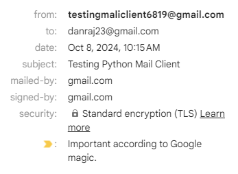

# Python Mailing Client with OAuth2

## Overview

This project is a Python-based mailing client that utilizes OAuth2 authentication to securely interact with the Gmail API for sending emails with attachments. It reads email content from a text file, attaches images or other files, and ensures safe communication by implementing several cybersecurity best practices, such as error handling, logging, input validation, HTML sanitization, and content filtering. These features make the application secure, resilient against potential vulnerabilities, and capable of programmatically sending emails from Gmail accounts.

## Features

- **OAuth2 Authentication**: Securely authenticate with Google to access Gmail API.
- **Email Composition**: Read email body from a text file.
- **File Attachment**: Attach files (e.g., `images`) to the email.
- **Input Validation**:

Email addresses are validated using regular expressions to ensure they conform to standard email formats, reducing the risk of processing `malicious` or `invalid input`.
- **HTML Sanitization**:

If the email body contains HTML content, it is sanitized using the `bleach` library. This ensures that only allowed tags (like `<b>`, `<i>`, and `<a>`) are included, preventing Cross-Site Scripting (XSS) attacks.
- **Error Handling**:

Throughout the code, try-except blocks capture and handle errors, ensuring that issues (e.g., `missing files`, `invalid credentials`) do not crash the program. All errors are logged for analysis, helping to identify potential problems in the application flow.
- **Logging**:

Logs are maintained for every action taken by the program (such as `authentication`, `email sending`, `errors`, etc.), providing a detailed trace of the client’s activities. This is essential for auditing, troubleshooting, and detecting abnormal behaviors.
- **Content Filtering**:

The email body is scanned for malicious URLs or potentially dangerous code (like `exec`, `eval`, `os.system`) using regex patterns. This helps block malicious content from being sent through the client, mitigating the risk of `phishing` or `malicious code injection`.

## Prerequisites

- Python 3.x installed.
- Google Cloud Project with Gmail API enabled.
- OAuth2 credentials downloaded in `credentials.json`.
- Required Python packages for google api, google auth, bleach

  
## Project Structure
├── `car.jpg`            # Image file to be attached to the email

├── `credentials.json`     # OAuth2 credentials file

├── `message.txt`          # Text file containing the email body

├── `mailing_client.py`    # Main script for the mailing client

└── `token.json`           # Token file to store user credentials

## Code Explanation

1. `authenticate_gmail()`

   **Purpose**: Authenticates the user using **OAuth2** and returns a Gmail API service instance.
   
   **Details**:
   - Checks if a `token.json` file exists to store user credentials and avoid re-authenticating every time.
   - If credentials are missing or expired, it refreshes them or re-authenticates using a web **OAuth** flow.
   - Saves credentials for future use.

   **Cybersecurity Consideration**: **OAuth2** ensures secure, token-based authentication for accessing user emails.

2. `is_valid_email(email)`

   **Purpose**: Validates the email address format to ensure it is correctly structured.

   **Details**:
   - Uses a **regular expression (regex)** to match standard email patterns.

   **Cybersecurity Consideration**: **Input validation** ensures only valid email addresses are processed, preventing malformed data from being submitted.

3. `contains_malicious_content(message_text)`

   **Purpose**: Scans email body for potentially malicious content, such as **URLs** or suspicious functions.

   **Details**:
   - Uses **regex patterns** to flag **malicious URLs** and dangerous code snippets.

   **Cybersecurity Consideration**: **Content filtering** helps prevent phishing attacks and **code injection** vulnerabilities.

4. `create_message(sender, to, subject, message_text)`

   **Purpose**: Creates an email message, attaches files, and encodes it for sending via Gmail.

   **Details**:
   - Reads the body of the email from a `message.txt` file.
   - **Sanitizes** any HTML content using the **bleach** library, allowing only basic formatting tags (e.g., `<b>`, `<i>`, `<a>`).
   - Attaches a file if it exists.
   - Converts the email into a **raw base64 encoded string** for sending via the Gmail API.

   **Cybersecurity Consideration**:
   - **HTML Sanitization**: Prevents **Cross-Site Scripting (XSS)** by sanitizing HTML content.
   - **Attachment Handling**: Avoids attaching **malicious files** by checking for file existence.

5. `send_message(service, sender, to, subject)`

   **Purpose**: Sends the created email message using the Gmail API.

   **Details**:
   - Validates both the **sender's** and **recipient’s** email addresses.
   - Sends the email if all checks pass and the message creation is successful.

   **Cybersecurity Consideration**:
   - **Error handling**: captures and logs any issues during the sending process, providing detailed logs for troubleshooting.

  

  

## Skills

**Skills** gained from this project include `Python programming`, `OAuth2 authentication`, `Gmail API integration`, `cybersecurity practices` (`error handling`, `logging`, `input validation`, `HTML sanitization`, `content filtering`), and `networking protocols` for secure email communication.
